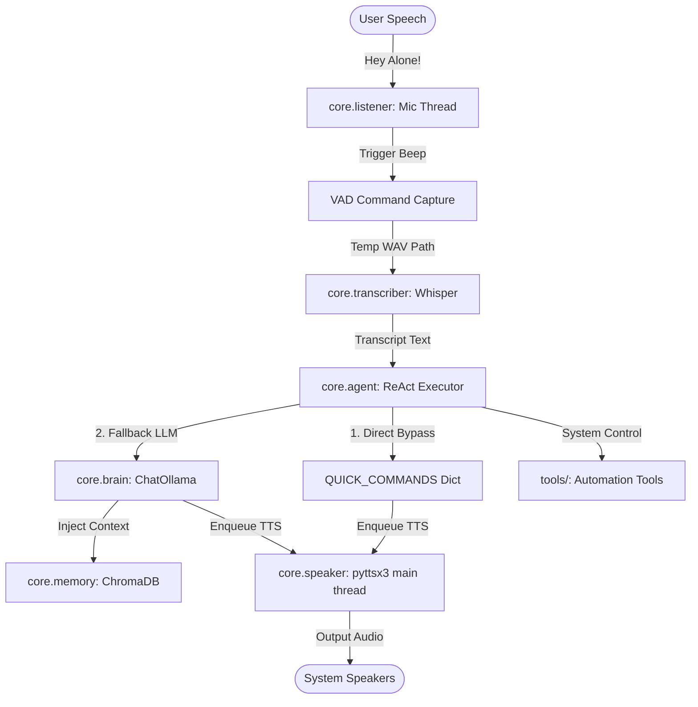

# A.L.O.N.E. — J.A.R.V.I.S. for Your Local Machine

<div align="center">

[](https://www.python.org/)
[](LICENSE)
[](https://www.microsoft.com/windows)
[](https://ollama.com)
[](https://github.com/openai/whisper)

**A.L.O.N.E.** (*A Local Offline Networked Entity*) is a fully local, privacy-centric, voice-activated AI personal assistant designed to run entirely on your desktop or laptop. No cloud API keys, no subscription fees, no data leaks.

[Explore Overview](docs/PROJECT_OVERVIEW.md) • [View Architecture](docs/ARCHITECTURE.md) • [Semantic Memory](docs/MEMORY_SYSTEM.md) • [Contribute](docs/DEVELOPER_GUIDE.md)

</div>

---

## 🎙️ The Concept

A.L.O.N.E. acts as an offline hardware-linked digital butler modeled after science-fiction AI sidekicks. By combining lightweight always-on voice engines, state-of-the-art offline transcription models, semantic memory storage, and system automation tools, A.L.O.N.E. runs silently in the background, ready to execute your commands in real time.

---

## ✨ Features

*   **🎙️ Always-On OWW Detection**: Low-overhead wake-word detection using `openwakeword` with both custom trained and fallback chimes.
*   **🎤 Smart Silence Cutoff (VAD)**: Dynamic capture driven by WebRTC VAD and audio energy calibration. Stops recording immediately (600ms) after you stop speaking and limits recording duration to a hard 9-second window.
*   **🧠 Local LLM ReAct Agent**: Runs `alone-model` (derived from llama3.2:3b) locally via ChatOllama, reasoning and selecting system tools dynamically.
*   **💾 Cross-Session Semantic Memory**: Integrates an offline ChromaDB vector database and local SentenceTransformers (`all-MiniLM-L6-v2`) to recall past interactions, settings, and files.
*   **⚡ Zero-Latency Quick Commands**: Intercepts common instructions (time, date, screenshot, opening YouTube/GitHub/VS Code) to execute them instantly under 1 second, bypassing LLM inference.
*   **🖥️ Circular HUD Interface**: A sleek, minimal PyQt5 HUD bubble that animates and responds to voice activity.
*   **🚀 Background Boot Warm-up**: Pre-warms the Whisper RAM and Ollama VRAM in parallel on background threads right at startup. Announce ready status chimes inside 20 seconds.

---

## 🏗️ High-Level System Flow



---

## 📦 Directory Structure

```plaintext
C:\Users\SHAN KUMAR\Desktop\ALONE
├── docs/                      # Technical documentation
│   ├── ARCHITECTURE.md        # High-level component map
│   ├── DEVELOPER_GUIDE.md     # Code reviews, folder setups
│   ├── MEMORY_SYSTEM.md       # Vector database and embeddings
│   ├── PROJECT_OVERVIEW.md    # Features and target scope
│   ├── ROADMAP.md             # Development priorities
│   └── VOICE_PIPELINE.md      # Voice sequence processing
└── alone/                     # Application source directory
    ├── Modelfile              # Ollama model definition
    ├── config.yaml            # Sound, VAD, and model thresholds
    ├── main.py                # App entrypoint and GUI event loop
    ├── setup.bat              # One-time virtual environment installer
    └── launch_alone.bat       # Direct background runtime launcher
```

---

## 🚀 Quick Start (5-Minute Setup)

### Prerequisites
*   Windows 10/11
*   Python 3.10+
*   [Ollama for Windows](https://ollama.com/download/windows) installed and running.

### 1. Build Virtual Environment
Clone the repository, open your command prompt inside the `alone` directory, and run the automated setup script:
```cmd
cd alone
setup.bat
```
*This will automatically build a `.venv` virtual environment and compile all required requirements.*

### 2. Custom Model Creation
Compile the optimized custom local model in Ollama:
```cmd
ollama create alone-model -f Modelfile
```

### 3. Launch A.L.O.N.E.
Double-click `launch_alone.bat` or run:
```cmd
launch_alone.bat
```
The sleek circular PyQt5 HUD window will pop up. You will hear A.L.O.N.E. speak:
> *"A.L.O.N.E. initializing. One moment please, Sir."*

Followed shortly by:
> *"All systems online. Good day, Sir."*

Say *"Hey Alone, what time is it?"* and test the instant voice response!

---

## 📸 Screenshots & UI

<div align="center">
  
  <p><em>The sleek, holographic circular PyQt5 HUD Interface that floats silently on your desktop.</em></p>
</div>

---

## 🗺️ Roadmap & Milestones

*   **Phase 1 (Completed)**: Low-latency startup pre-warming, WebRTC VAD threshold cutoffs, openwakeword integration, zero-latency system bypass commands, and single-venv cleanup.
*   **Phase 2 (Mid-Term)**: Microphones hot-plugging recovery, live amplitude GUI waveform drawings, and recency-weighted vector database queries.
*   **Phase 3 (Long-Term)**: neural voice TTS, vision vision screenshot explanations, smart-home air-gapped hubs, and advanced mouse-click desktop automation.

---

## 🤝 Contributing

We welcome issues, feedback, and pull requests! Please read our [Developer & Contributor Guide](docs/DEVELOPER_GUIDE.md) to understand codebase styles, folder mappings, testing procedures, and architectural reviews.

---

## 📄 License

This project is licensed under the MIT License — see the [LICENSE](LICENSE) file for details.
