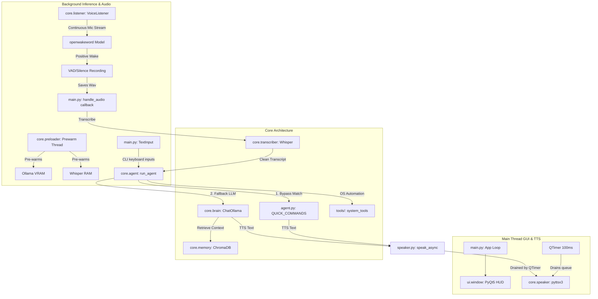

# System Architecture

This document describes the high-level design, thread structure, module relationships, and data flow of **A.L.O.N.E.**

---

## 🏗️ High-Level System Architecture

A.L.O.N.E. operates as a hybrid event-driven and multi-threaded desktop application. The GUI operates on the **Main Thread**, while microphone streaming, wake-word detection, and text input run on dedicated **Background Threads**.

---

## 🧵 Thread Boundaries & Execution Flow

To prevent application freezing and comply with Windows COM multi-threaded apartment rules, A.L.O.N.E. divides processing strictly across threads:

1.  **Main Thread**:
    *   Initializes PyQt5 HUD and Settings windows.
    *   Spins up a 100ms `QTimer` (`speech_timer_tick`) which checks the speech queue and executes `pyttsx3` text-to-speech. This prevents audio-card device locking.
2.  **VoiceListener Background Thread**:
    *   Initiated on boot. Runs continuous microphone streaming using `sounddevice`.
    *   Processes 80ms chunks through the `openwakeword` ONNX engine.
    *   Closes the wake-word stream upon trigger and captures the voice command using a fast WebRTC VAD loop, writing the command to a temporary `.wav` file before passing its path to `handle_audio()`.
3.  **TextInput Background Thread**:
    *   Waits for fallback terminal keyboard inputs and safely passes text commands to the agent.
4.  **Prewarmer Background Thread**:
    *   Executed first. Pre-warms the Ollama VRAM, faster-whisper RAM, and wake word model files sequentially, raising a `threading.Event()` when ready to unlock the voice listener.

---

## 📦 Core Modules

### 1. `main.py`
*   **Responsibility**: Application bootstrapper, thread orchestrator, and PyQt5 GUI runner.
*   **Inputs**: CLI arguments, voice-listener callback parameters.
*   **Outputs**: GUI HUD display, background thread hooks, application shutdown sequence.
*   **Dependencies**: `PyQt5`, `core.speaker`, `core.listener`, `core.preloader`.

### 2. `core/preloader.py`
*   **Responsibility**: Sequential background system pre-warming on startup to prevent cold-boot lag.
*   **Inputs**: Configurations from `config.yaml`.
*   **Outputs**: Thread-safe readiness event flag, pre-loaded Whisper and Wake Word instances.
*   **Dependencies**: `ollama`, `faster_whisper`, `core.listener`.

### 3. `core/listener.py`
*   **Responsibility**: Background audio capture, wake-word detection, and WebRTC/Energy-based Voice Activity Detection (VAD).
*   **Inputs**: Audio stream from `sounddevice`.
*   **Outputs**: Local path to recorded `.wav` file of spoken command, OWW prediction scores.
*   **Dependencies**: `openwakeword`, `sounddevice`, `webrtcvad` (optional), `numpy`.

### 4. `core/transcriber.py`
*   **Responsibility**: Converts recorded WAV audio files into text strings.
*   **Inputs**: File path of local `.wav` file.
*   **Outputs**: UTF-8 transcript string.
*   **Dependencies**: `faster-whisper` (CUDA/CPU).

### 5. `core/agent.py`
*   **Responsibility**: The brain's execution engine. Contains `QUICK_COMMANDS` for zero-latency static bypass, and sets up the ReAct agent framework for LLM-driven actions.
*   **Inputs**: Transcription string.
*   **Outputs**: Voice reply string, executed system tools.
*   **Dependencies**: `langchain`, `langchain-ollama`, `tools`, `core.memory`.

### 6. `core/brain.py`
*   **Responsibility**: Manages history session logs, pulls semantic long-term memories, and queries ChatOllama.
*   **Inputs**: Prompt strings, user instructions.
*   **Outputs**: LLM-generated assistant responses.
*   **Dependencies**: `ollama`, `langchain-ollama`, `core.memory`.

### 7. `core/speaker.py`
*   **Responsibility**: Synchronous, main-thread-safe Text-to-Speech (TTS) synthesis.
*   **Inputs**: Response strings via `speak_async()` thread-safe queue.
*   **Outputs**: Spoken audio via system speakers, CLI stdout print.
*   **Dependencies**: `pyttsx3`, `pythoncom`.

### 8. `core/memory.py`
*   **Responsibility**: Long-term persistent vector database memory storage and semantic context retrieval.
*   **Inputs**: Interaction queries, user preferences.
*   **Outputs**: Vector embeddings, top-k semantically relevant historical strings.
*   **Dependencies**: `chromadb`, `sentence-transformers`.

### 9. `tools/`
*   **Responsibility**: Collection of system automation actions available to the ReAct agent.
    *   `tools/system.py`: `open_app`, `open_file`, `run_shell`, `type_text`, `take_screenshot`.
    *   `tools/browser.py`: `open_url`.
    *   `tools/search.py`: `web_search`.
*   **Dependencies**: `pyautogui`, `selenium`, `duckduckgo-search`.
