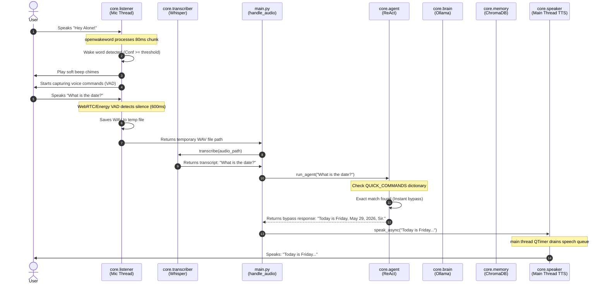

# Voice Pipeline Documentation

This document explains the complete voice pipeline flow in **A.L.O.N.E.** from the moment you speak the wake word to the final spoken audio response.

---

## 🔁 End-to-End Pipeline Overview

A.L.O.N.E. processes speech through a series of discrete local stages:

```
[ Wake Word ] ──> [ Voice Capture (VAD) ] ──> [ Transcription (Whisper) ]
                                                     │
                                                     ▼
[ Spoken TTS ] <── [ Response Gen ] <── [ Memory / Tools ] <── [ Intent Router ]
```

---

## 📊 Interaction Sequence Diagram

The following sequence diagram outlines how data traverses across background threads, processing cores, and local databases when a voice command is spoken.



---

## 🛠️ Step-by-Step Pipeline Breakdown

### 🎙️ Step 1: Wake Word Detection (`openwakeword`)
*   **Action**: Background `VoiceListener` thread continuously streams microphone input in `1280` sample blocks (80ms at 16000Hz).
*   **Inference**: The stream is fed into the `openwakeword` ONNX runtime engine to predict wake-word probability.
*   **Trigger**: If prediction probability exceeds `threshold` (default `0.5` in `config.yaml`), the wake-word is confirmed, a beep plays, and the stream shifts to the capture mode.

### 🎤 Step 2: Voice Activity Detection & Audio Capture
*   **VAD Capture**: The microphone stream block size drops to `480` samples (30ms chunks at 16kHz) to enable precise voice activity detection via WebRTC VAD.
*   **Speech Detection**: A ring buffer of 10 frames tracks raw audio. If 3 or more frames contain speech, recording state is confirmed.
*   **Speech End Cutoff**: Once speech has started, the listener tracks silent frames. If `20` consecutive frames (600ms) contain silence, the recording stops instantly (`Speech ended ✅`).
*   **Hard Cutoff**: If recording reaches `300` frames (9 seconds), it stops automatically (`Max time reached`). The audio is saved as a 16-bit PCM mono `.wav` file in the system temp folder.

### 📝 Step 3: Local Speech-to-Text Transcription (`faster-whisper`)
*   **Warming Advantage**: The saved `.wav` path is sent to `core.transcriber.transcribe()`.
*   **Inference**: `faster-whisper` processes the file using its pre-warmed memory model (on CUDA GPU in `float16` or fallback CPU in `int8`), translating the raw wav file into a clean text string.

### 🔀 Step 4: Intent Routing & QUICK_COMMANDS
*   The transcription text is evaluated in [core/agent.py](file:///c:/Users/SHAN%20KUMAR/Desktop/ALONE/alone/core/agent.py):
    *   **Zero-Latency Bypass**: If the text matches standard system commands (e.g. *"open google"*, *"what time is it"*), the LLM is completely bypassed, and the quick command executes immediately, delivering a reply in under 1 second.
    *   **Fallback Agent**: If the instruction is a complex reasoning query, it falls through to the LangChain ReAct agent.

### 🧠 Step 5: ReAct Agent & System Tool Execution (LangChain)
*   **Thought Loop**: The agent determines if it needs to use system tools to fulfill the query (e.g. search Google, run shell command, type text).
*   **Tool Execution**: Executes the appropriate Python script from `tools/` with validated parameters and stores execution outputs.

### 💾 Step 6: Memory Retrieval & Response Generation (ChromaDB & Ollama)
*   **Semantic Search**: Conversational history and relevant semantic contexts are fetched from the local ChromaDB database based on vector similarity.
*   **Ollama Chat**: The context and system prompts are sent to `ChatOllama` querying `alone-model` with `keep_alive="60m"` to prevent VRAM unloading. 

### 🔊 Step 7: Main-Thread Text-to-Speech (`pyttsx3`)
*   The final text string is placed into a thread-safe Queue via `speak_async()`.
*   The main thread GUI event loop picks up the queued item every 100ms and invokes the `pyttsx3` voice synthesizer on the main thread, completing the interaction cycle.
