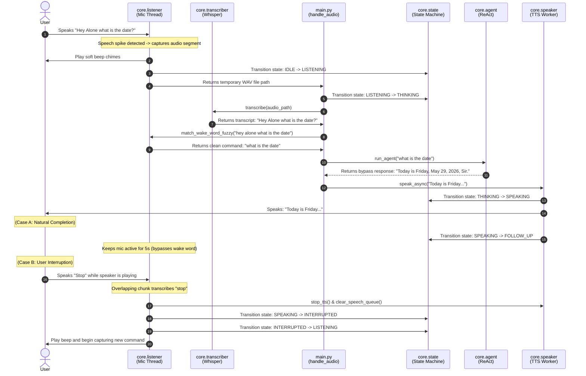

# Voice UX Pipeline Documentation

This document explains the complete voice pipeline flow and state machine transitions in **A.L.O.N.E.** from the moment you speak a wake word to the final spoken audio response and follow-ups.

---

## 🔁 End-to-End Pipeline Overview

A.L.O.N.E. processes speech through a series of discrete local stages backed by a robust thread-safe state machine:

```
[ IDLE ] ──(Wake Word/VAD)──> [ LISTENING ] ──(Transcribe)──> [ THINKING ]
                                                                   │
                                                                   ▼
[ FOLLOW_UP ] <──(Speech End)── [ SPEAKING ] <──(Execute TTS)──────┘
     │                              │
     ├──(Timeout)──> [ IDLE ]      └──(User Stop Word)──> [ INTERRUPTED ] ──> [ LISTENING ]
```

---

## 📊 Interaction Sequence Diagram

The following sequence diagram outlines the one-shot voice execution flow:



---

## 🛠️ Step-by-Step Pipeline Breakdown

### 🎙️ Step 1: Wake Word Detection & One-Shot Stripping
*   **Fuzzy Matching**: Supported wake words are `hey alone`, `ok alone`, and `listen`.
*   **One-Shot Mode**: If you speak a command in one breath (e.g., *"Hey Alone who am I?"*), the Whisper transcript captures the wake word and command together. `match_wake_word_fuzzy` detects the wake word, removes it, and runs the remaining text (e.g. *"who am i"*) directly.

### 🎤 Step 2: Voice Activity Detection & Audio Capture
*   **VAD Capture**: WebRTC VAD and audio energy calibration process microphone blocks.
*   **Speech Detection**: A ring buffer tracks frames. Recording starts when speech is detected.
*   **Cutoff**: Silence of 600ms triggers instant recording end. Hard cutoff at 9 seconds. Saved as a temp mono `.wav` file.

### 📝 Step 3: Local Speech-to-Text Transcription (`faster-whisper`)
*   **Inference**: Converts `.wav` to clean text. Runs on GPU (CUDA float16) or CPU (int8). Sets state to `THINKING`.

### 🔀 Step 4: Intent Routing & QUICK_COMMANDS
*   Evaluates command in `core/agent.py`. Zero-latency bypass routes matches (e.g. opening browser, screens, or preference queries) instantly, bypassing LLM inference.

### 🔊 Step 5: Asynchronous TTS & Interruption (Barge-In)
*   **Windows TTS Process**: TTS runs as a background process using `subprocess.Popen` in a dedicated thread to avoid COM/GUI freezing. Sets state to `SPEAKING`.
*   **Interrupt Monitor**: Microphone remains active during TTS playback. Listener transcribes overlapping 1.6-second clips. If any of the words `"stop"`, `"pause"`, `"cancel"`, `"enough"`, or `"listen"` are detected, it terminates the TTS process, clears the speech queue, transitions to `INTERRUPTED` then `LISTENING`, and instantly beeps to capture the next command.

### 🔄 Step 6: Conversation Follow-Up Mode
*   **5-Second Window**: Once speaking ends naturally, the state machine transitions to `FOLLOW_UP`.
*   **No Wake Word**: Listener captures any speech spike within 5 seconds and processes it directly as a command without requiring a wake word.
*   **Timeout**: If no speech is captured within 5 seconds, the state machine transitions to `IDLE` (logs timeout).

