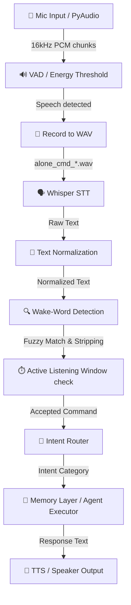

# Pipeline Regression Audit & Discovery Report

This report documents the architectural audit, git analysis, and mathematical breakdown of the recent speech pipeline regression in the A.L.O.N.E. project.

---

## 🗺️ 1. Complete Speech Pipeline Execution Path

A spoken command travels through the following stages:



### Responsible Components & Tracing

| Pipeline Stage | Responsible File | Class / Functions | Description & Byte/Data Flow |
| :--- | :--- | :--- | :--- |
| **Audio Input** | [listener.py](file:///c:/Users/SHAN%20KUMAR/Desktop/ALONE/alone/core/listener.py) | `start_listening`, `_listen_loop` | Captures raw audio chunks (1280 samples at 16kHz mono) from `sounddevice.InputStream` as `int16` NumPy arrays. |
| **VAD** | [listener.py](file:///c:/Users/SHAN%20KUMAR/Desktop/ALONE/alone/core/listener.py) | `record_until_silence`, `webrtcvad.Vad` | Computes RMS energy of chunks. If RMS >= `energy_threshold`, captures speech frames until `max_silent_frames` (20 frames) is exceeded. Saves to a temporary WAV file in `tempfile.gettempdir()`. |
| **Whisper STT** | [transcriber.py](file:///c:/Users/SHAN%20KUMAR/Desktop/ALONE/alone/core/transcriber.py) | `transcribe` | Reads the WAV file, performs Whisper model inference, and returns raw text. |
| **Normalization** | [listener.py](file:///c:/Users/SHAN%20KUMAR/Desktop/ALONE/alone/core/listener.py) | `normalize_text` | Downcases the text, removes punctuation, and normalizes spacing. |
| **Wake Word** | [listener.py](file:///c:/Users/SHAN%20KUMAR/Desktop/ALONE/alone/core/listener.py) | `match_wake_word_fuzzy` | Compares two-word combinations of input against targets `"hey alone"`, `"ok alone"`. Returns `(detected, matched_phrase, confidence, clean_command)`. |
| **Listening Window** | [main.py](file:///c:/Users/SHAN%20KUMAR/Desktop/ALONE/alone/main.py) | `handle_audio` | Checks if `time.time() - last_interaction_time <= 15.0`. If inside the active window, it accepts direct speech. If outside, it requires `detected == True` and extracts `clean_command`. |
| **Intent Router** | [agent.py](file:///c:/Users/SHAN%20KUMAR/Desktop/ALONE/alone/core/agent.py) | `determine_intent`, `heuristics_classify`, `llm_classify` | Maps user input to `USER_PROFILE_UPDATE`, `MEMORY_STORE`, etc. |
| **Memory / Executor** | [agent.py](file:///c:/Users/SHAN%20KUMAR/Desktop/ALONE/alone/core/agent.py) | `run`, `UserProfileService` | Executes user profile persistence, system tools, or ReAct agent fallback. |
| **Response / TTS** | [speaker.py](file:///c:/Users/SHAN%20KUMAR/Desktop/ALONE/alone/core/speaker.py) | `speak_async` | Pushes response text to the speech queue for async TTS playback. |

---

## 🔍 2. Git History & Regression Analysis

Comparing changes between commit `6531bfc` (last-known working state) and `HEAD` (`1c46c39`):

### Introduced Alterations:
1. **Restructured `match_wake_word_fuzzy`**:
   - In commit `724574a`, fuzzy matching was refactored to calculate similarity using Levenshtein distance on any 2-word phrase from the input.
   - The formula used: `sim = 1.0 - (dist / max(len(phrase), len(target)))` with a default `threshold = 0.75`.
2. **Listener Loop Callback Mod**:
   - VAD fallback loop was changed to call the callback with only `audio_path`, meaning `wake_word_detected` defaults to `False`.
   - Consequently, `handle_audio` in `main.py` is forced to re-run `match_wake_word_fuzzy(normalized_text)` to determine if the wake word is present.
3. **Broad User Profile Heuristics**:
   - Commit `1c46c39` added broad regex patterns like `r"^i\s+am\s+"` to `heuristics_classify`.
   - This matches any command starting with "I am" (e.g. `"I am going to check my files"`) and incorrectly routes it to `USER_PROFILE_UPDATE`, skipping `TOOL_EXECUTION`.

---

## 🧮 3. Mathematical & Fuzzy Match Analysis

### Why `"you alone"` and `"be alone"` False-Trigger

Under the current Levenshtein matching formula:
$$\text{Similarity} = 1.0 - \frac{\text{Levenshtein Distance}(P, T)}{\max(|P|, |T|)}$$

#### Case A: `"you alone"` vs target `"ok alone"`
- $P = \text{"you alone"}$ (length 9)
- $T = \text{"ok alone"}$ (length 8)
- Edits to transform $P$ to $T$:
  1. Substitute `y` $\rightarrow$ `o`
  2. Substitute `u` $\rightarrow$ `k`
- Levenshtein Distance = 2.
- Similarity:
  $$\text{Similarity} = 1.0 - \frac{2}{9} \approx 0.778$$
- Since $0.778 \ge 0.75$, this triggers wake-word detection.

#### Case B: `"be alone"` vs target `"hey alone"`
- $P = \text{"be alone"}$ (length 8)
- $T = \text{"hey alone"}$ (length 9)
- Edits to transform $P$ to $T$:
  1. Substitute `b` $\rightarrow$ `h`
  2. Insert `y`
- Levenshtein Distance = 2.
- Similarity:
  $$\text{Similarity} = 1.0 - \frac{2}{9} \approx 0.778$$
- Since $0.778 \ge 0.75$, this triggers wake-word detection.

#### Case C: `"see you alone"`
- Splitting the input yields phrase `"you alone"`.
- As shown in Case A, `"you alone"` matches `"ok alone"` with $0.778 \ge 0.75$.
- The wake word is detected, and it is stripped from `"see you alone"`, leaving `"see"` as the clean command, which is either discarded or fails validation.

---

## 🚧 4. Pipeline Failure Diagram

```
User Speaks: "Hey Alone, my name is Subrato..."
       │
       ▼
Whisper STT Transcribes: "hello my name is shubuto..."
       │
       ▼
Normalized: "hello my name is shubuto..."
       │
       ▼
Wake Word Matcher:
 - Targets: "hey alone" (length 9), "ok alone" (length 8)
 - Input words: ["hello", "my", "name", ...]
 - Max similarity found: 0.55 (no match)
       │
       ▼
Result: Wake word FAILED (not detected)
       │
       ▼
Active Window Check:
 - Outside active window (elapsed time > 15s)
       │
       ▼
Result: Command DISCARDED (Never reaches Intent Router)
```

---

## 🛠️ 5. Next Steps for Verification

Before implementing code changes, we will:
1. Complete a virtual-environment test suite run to verify existing baselines.
2. Implement a non-intrusive diagnostic mode to log details without altering normal HUD output.
3. Validate transcription behavior with simulated inputs.
